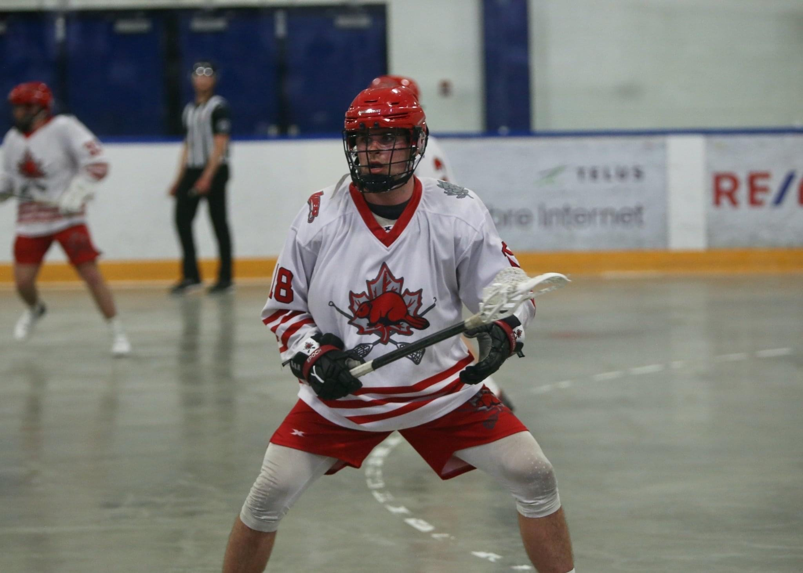

# Supa Cool Website

This image depicts me playing lax. Do you see? Do you see? Do you see? This is the second element required of the main foundational elements of this assignment. This second element is to display text to the left of an image on my website thing. I got to be careful that my image is to the right of the text and that my spelling is bad. I have succeeded in both. Just like me playing lacrosse. Do you see?

---

RED OR DEAD BABYYYY WEEEEOOOOOO!!! FTM!!

---

This sport helps me keep a healthy  
VO₂ Max (with dot).  
Yum, some good oxygen in my lungs

[Come See My Readme File](https://github.com/BenLutzko/KNES381/blob/main/readme.md)

[EEORRRRRRRRR](file:///C:\Users\Ben Lutzko\Pictures\Camera
